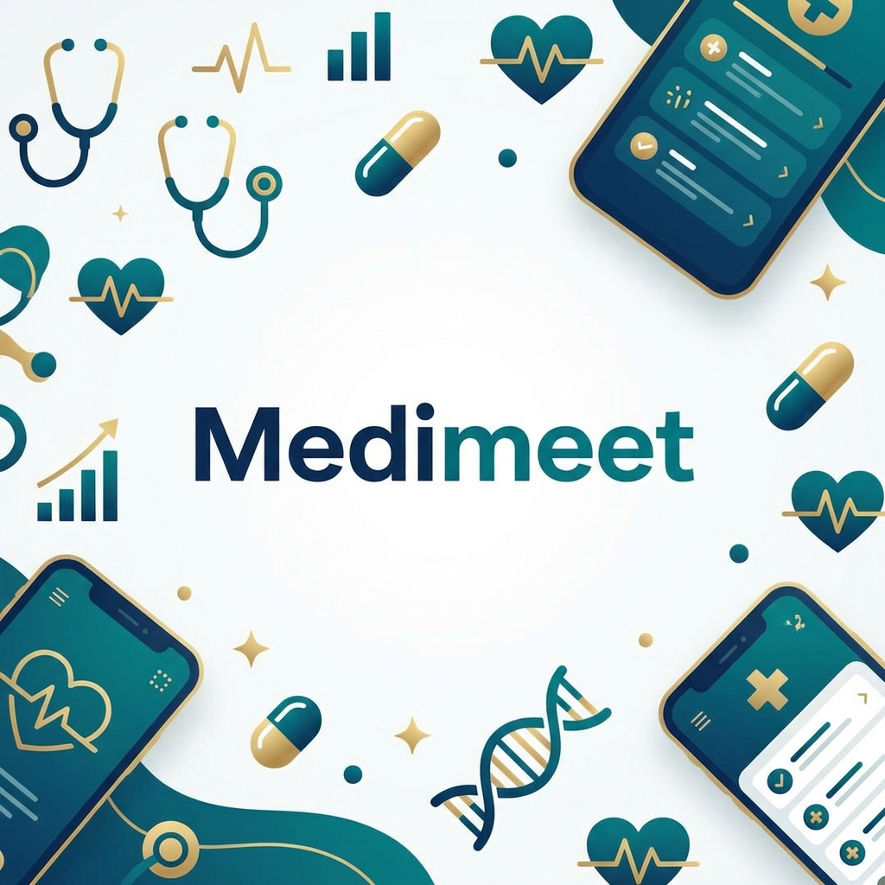
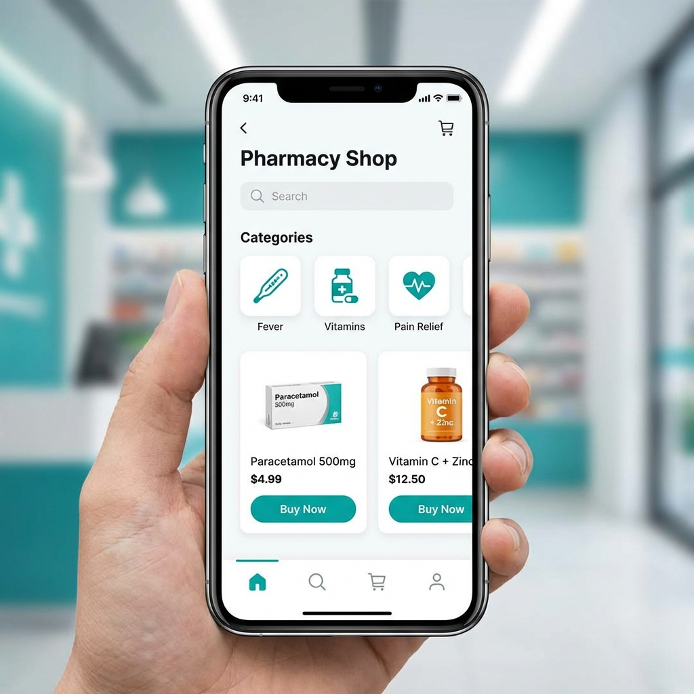
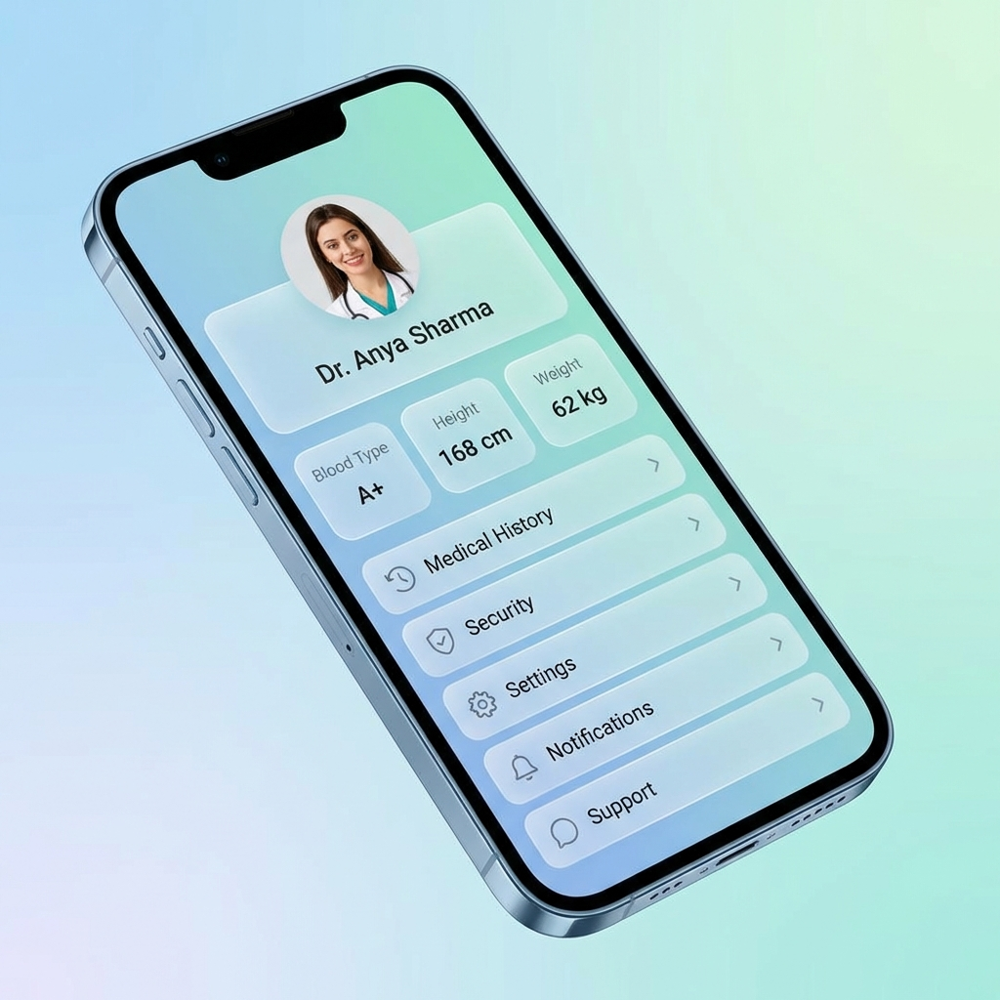

<p align="center">
  
</p>

<h1 align="center">🩺 Medimeet App</h1>

<p align="center">
  <strong>The Future of Digital Healthcare Management</strong>
</p>

<p align="center">
  
  
  
  
</p>

---

## 📖 Overview

**Medimeet** is a state-of-the-art healthcare ecosystem meticulously crafted using **Flutter**. It empowers users with a unified platform to manage their entire health journey—from discovering expert medical advice and ordering medications to tracking mental well-being and managing emergency services.

Our mission is to provide **accessible, rapid, and premium** healthcare services to everyone, everywhere.

---

## ✨ Immersive Features

### 🏥 Clinical Mastery
*   **Smart Doctor Discovery:** Filter by specialty, rating, or proximity to find your perfect match.
*   **One-Tap Booking:** Experience the most frictionless appointment scheduling flow.
*   **Digital Prescriptions:** Receive and store prescriptions directly in your secure vault.

### 🧪 Diagnostic & Pharmacy Hub
*   **Virtual MediShop:** Browse thousands of verified healthcare products with AI-driven suggestions.
*   **At-Home Lab Tests:** Schedule sample collections and receive encrypted digital reports.
*   **Fast Pharmacy:** Track your medicine delivery in real-time with our express logistics integration.

### 🚑 Critical Care & Mental Wellness
*   **Emergency Dispatch:** One-button activation for specialized ambulance services.
*   **Mindset Tracker:** Daily mood journaling and AI-powered mental health tips.
*   **Therapy Access:** Connect with certified counselors for private video consultations.

---

## 🎨 Design Language

| **Onboarding Journey** | **Smart Pharmacy** | **Health Insights** |
| :---: | :---: | :---: |
|  |  |  |
| *Immersive Welcome* | *Inventory Management* | *Personalized Vitals* |

---

## 🚀 Technical Architecture

Medimeet is built on a "Mobile-First" philosophy, ensuring high performance even on low-tier devices.

- **Frontend:** Flutter SDK (Declarative UI)
- **State Engine:** Provider pattern for reactive data flow
- **Design System:** Custom `AppColors` tokens, premium glassmorphism, and responsive layouts
- **Localization:** Multi-language support (English & Urdu)

---

## 📑 Changelog

### **💎 v2.1.0 (Current Update)**
> *Focus: Premium Aesthetic & Professionalism*
*   **Revamped UX:** Fully animated Splash and Onboarding screens with custom path clipping.
*   **Auth Overhaul:** Professional Login/Signup screens with fade-in animations and modern layout hierarchy.
*   **Health Vitals:** Redesigned Profile stats (Blood, Height, Weight) for better spacing and visibility.
*   **Branding:** Cleaned up project-wide branding, removing legacy tags for a unified corporate look.

### **✨ v2.0.0**
*   Added comprehensive Mental Health module with mood tracking.
*   Integrated Ambulance service caller with emergency protocols.
*   Implemented Urdu language localization.

---

## 🛣 Future Roadmap

- [ ] AI Symptom Checker integration
- [ ] Direct Video Call for Telemedicine
- [ ] Smart Watch (WearOS/WatchOS) data syncing
- [ ] Pharmacy Order History with automated refills

---

## 🛠 Getting Started

### Prerequisites
- Flutter SDK (latest stable)
- Android Studio / VS Code
- A passion for healthcare tech!

### Installation
1.  **Clone the Repository**
    ```bash
    git clone https://github.com/Choudhary-Khuzaim/medimeet.git
    ```
2.  **Install Dependencies**
    ```bash
    flutter pub get
    ```
3.  **Launch Primary Target**
    ```bash
    flutter run
    ```

---

## 🤝 Contribution & Feedback

We welcome contributions! If you have ideas for improving Medimeet:
1.  Fork the Project
2.  Create your Feature Branch (`git checkout -b feature/AmazingFeature`)
3.  Commit your Changes (`git commit -m 'Add some AmazingFeature'`)
4.  Push to the Branch (`git push origin feature/AmazingFeature`)
5.  Open a Pull Request

---

<p align="center">
  <strong>Developed with ❤️ by <a href="https://github.com/Choudhary-Khuzaim">Khuzaim Sajjad</a></strong><br/>
  <em>Building the Next Generation of Digital Wellness.</em>
</p>
