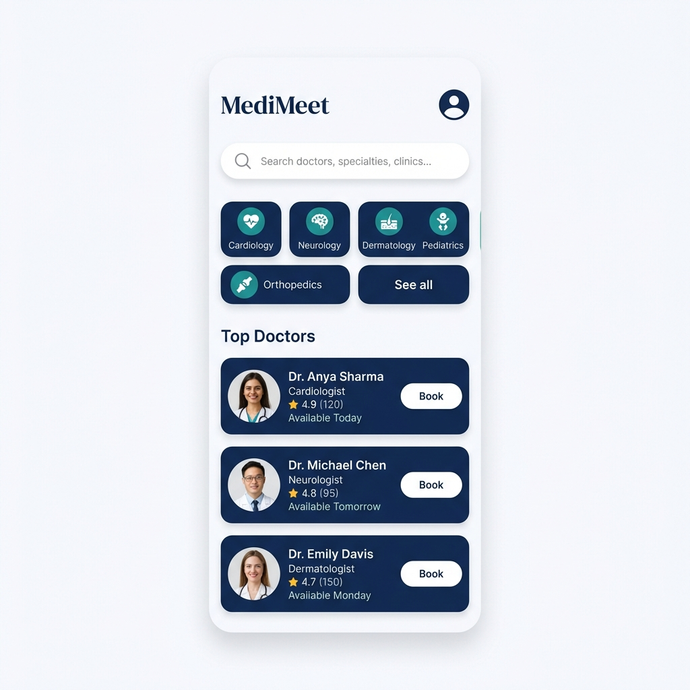

<p align="center">
  
</p>

# 🏥 MediMeet - Your Personal Healthcare Companion

<p align="center">
  
  
  
</p>

---

## 📖 Table of Contents
- [🌟 Overview](#-overview)
- [✨ Key Features](#-key-features)
- [🎨 Design System](#-design-system)
- [📱 App Screenshots](#-app-screenshots)
- [🛠️ Tech Stack](#-tech-stack)
- [📂 Project Structure](#-project-structure)
- [🚀 Installation](#-installation)
- [🗺️ Roadmap](#-roadmap)
- [🤝 Contributing](#-contributing)
- [📬 Contact](#-contact)

---

## 🌟 Overview
**MediMeet** is a premium, high-fidelity healthcare application built with **Flutter** and **Dart**. It simplifies the healthcare experience by connecting patients with top-rated doctors, managing medical records, and streamlining the appointment booking process. 

Designed with a focus on **User Experience (UX)** and **Visual Excellence**, MediMeet provides a seamless, state-of-the-art interface for all your medical needs. Whether you're booking a specialist or tracking your medical history, MediMeet makes it effortless.

---

## ✨ Key Features

### 👨‍⚕️ Doctor Discovery
- **Smart Search**: Find doctors by name, specialty, or clinic location.
- **Detailed Profiles**: Comprehensive doctor information including experience, ratings, and availability.
- **Specialty Categories**: Quick filters for Cardiology, Neurology, Pediatrics, etc.

### 📅 Appointment Management
- **Instant Booking**: Secure your slot with a few taps using an interactive calendar.
- **Dynamic Slots**: Real-time availability tracking for time slots.
- **Status Updates**: Track "Upcoming", "Completed", and "Cancelled" appointments.

### 📋 Digital Medical Records
- **Secure Records**: Keep your diagnoses, prescriptions, and lab notes in one safe place.
- **Searchable History**: Access your medical timeline with ease.
- **Detail View**: Full breakdown of each medical visit.

### 🎨 Premium UI/UX & Localization
- **Theme Awareness**: Full support for **Dark Mode** and **Light Mode**.
- **Localization**: Supports **English** and **Urdu (اردو)** out of the box.
- **Material 3**: Clean, modern aesthetics following the latest design patterns.

---

## 🎨 Design System

We believe in visual excellence. MediMeet follows a curated color palette:

| Color | Hex | Role |
| :--- | :--- | :--- |
| **Deep Navy** | `#1D3557` | Primary Brand Color |
| **Teal** | `#00A0AB` | Secondary / Success |
| **Warm Amber** | `#FFB703` | Call to Action / Accents |
| **Soft Background**| `#F5F7FA` | Primary Surface / Background |

---

## 📱 App Showcase

<p align="center">
  
</p>

### Key Screens
| Dashboard | Booking | Records |
| :---: | :---: | :---: |
|  | *Coming Soon* | *Coming Soon* |

---

## 🛠️ Tech Stack

- **Framework**: [Flutter](https://flutter.dev) (v3.27.0+)
- **Language**: [Dart](https://dart.dev)
- **State Management**: [Provider](https://pub.dev/packages/provider)
- **Localization**: `flutter_localizations` (English & Urdu)
- **Utilities**: 
  - `Geolocator` & `Geocoding` (for location tracking)
  - `Intl` (for date/time formatting)
  - `Table Calendar` (for booking)

---

## 📂 Project Structure

```text
lib/
├── models/         # Data blueprints for Doctors, Appointments & Records
├── providers/      # Global state management logic
├── screens/        # High-fidelity UI screens and layouts
├── services/       # Business logic and mock/real API services
├── utils/          # App constants, themes, and design tokens
└── widgets/        # Modular, reusable UI components
```

---

## 🚀 Installation

### Prerequisites
1. Install [Flutter SDK](https://docs.flutter.dev/get-started/install)
2. Setup your favorite IDE (VS Code or Android Studio)
3. Connect an emulator or physical device

### Steps to Run
1. **Clone the repository**
   ```bash
   git clone https://github.com/Choudhary-Khuzaim/MediMeet.git
   ```
2. **Navigate to project directory**
   ```bash
   cd medimeet
   ```
3. **Download packages**
   ```bash
   flutter pub get
   ```
4. **Generate localization (if needed)**
   ```bash
   flutter gen-l10n
   ```
5. **Launch the app**
   ```bash
   flutter run
   ```

---

## 🗺️ Roadmap
- [ ] **Push Notifications**: Real-time alerts for appointments.
- [ ] **AI Symptoms Checker**: Basic AI-driven health suggestions.
- [ ] **Lab Integration**: Directly download lab results in the app.
- [ ] **Payment Gateway**: Seamless checkout for consultation fees.
- [ ] **Video Consultation**: Online doctor meetings via WebRTC.

---

## 🤝 Contributing
Contributions make the community better! 

1. **Fork** the project
2. Create your **Feature Branch** (`git checkout -b feature/AmazingFeature`)
3. **Commit** your changes (`git commit -m 'Add some AmazingFeature'`)
4. **Push** to the branch (`git push origin feature/AmazingFeature`)
5. Open a **Pull Request**

---

## � Contact
**Khuzaim Sajjad** - [@Choudhary-Khuzaim](https://github.com/Choudhary-Khuzaim)

Project Link: [https://github.com/Choudhary-Khuzaim/MediMeet](https://github.com/Choudhary-Khuzaim/MediMeet)

---

<p align="center">
  <b>Built for a healthier tomorrow.</b><br>
  Developed with ❤️ by Khuzaim Sajjad
</p>
